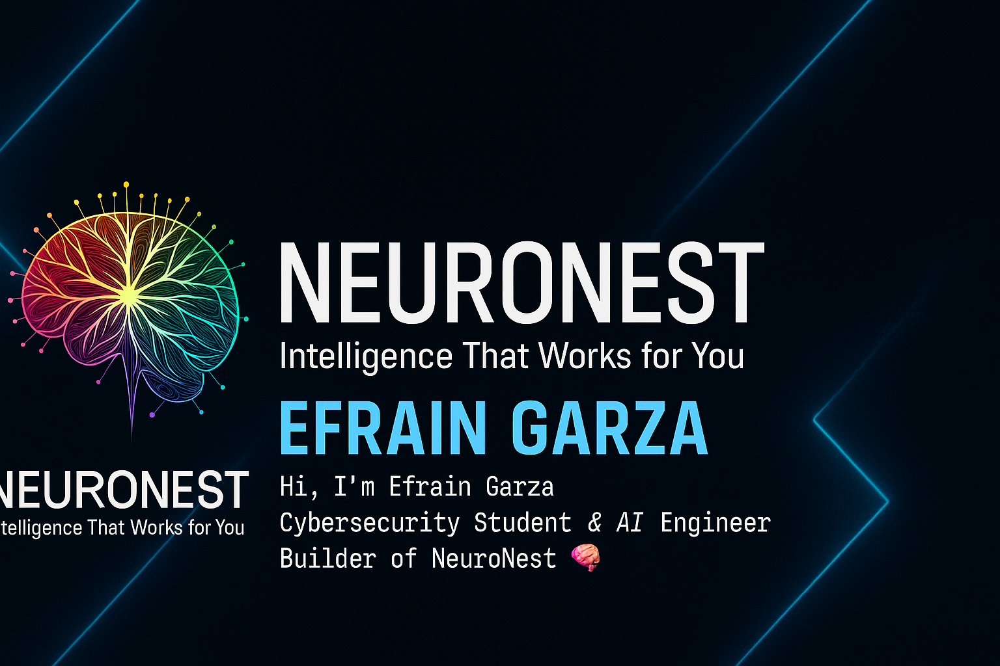

# NeuroNest
**Intelligence That Works for You**  
_Where AI meets everyday life._

---

## 👋 Welcome

Hi, I’m **Efrain Garza** — veteran, builder, and future cybersecurity specialist. NeuroNest is my personal innovation lab for blending **AI**, **automation**, and **security** into powerful tools that simplify life and push boundaries.

---

## 🚧 Current Projects

- 🧰 **HackyPi Toolkit** – Custom pentesting and data tools  
- 🌐 **NeuroNest Website** – GitHub Pages-powered site

---

## 🔧 I’m currently learning

- Ethical Hacking & Penetration Testing (CEH prep, Kali, Parrot OS)  
- Web Dev (HTML, CSS, JS, GitHub Pages)  
- AI Automation (Python, Coqui TTS, local LLMs)  
- Cybersecurity & Forensics  
- Cross-platform Dev (Windows, Linux, Android)

---

## 🧰 Tech Stack

## 🧰 Tech Stack

-ff6600?style=for-the-badge)

---

## 📫 Contact

- 📧 Garzaefrain817@outlook.com  
- 🧠 ORCID iD: [https://orcid.org/0009-0005-3504-6644](https://orcid.org/0009-0005-3504-6644)  
- 🔗 GitHub: [cyberops-cmmdr](https://github.com/cyberops-cmmdr)

---

> 💬 *“Every great mind needs a nest.”* — NeuroNest
